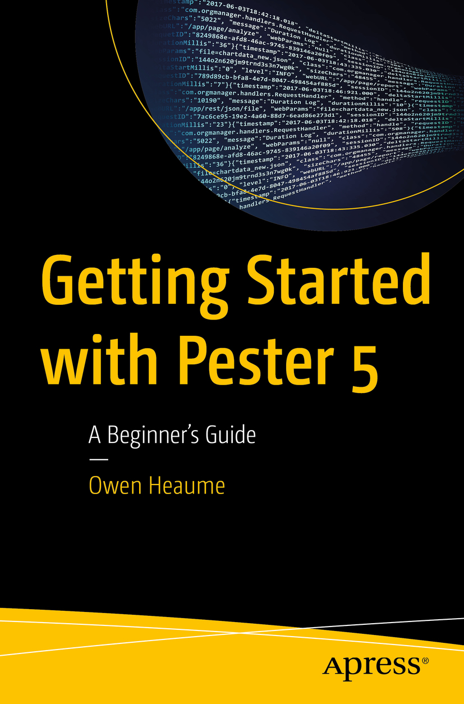

# Apress Source Code

This repository accompanies [*Getting Started with Pester 5*](https://link.springer.com/book/9798868803055) by Owen Heaume (Apress, 2024).

[comment]: #cover

Download the files as a zip using the green button, or clone the repository to your machine using Git.

## Releases

Release v1.0 corresponds to the code in the published book, without corrections or updates.

## Contributions

See the file Contributing.md for more information on how you can contribute to this repository.